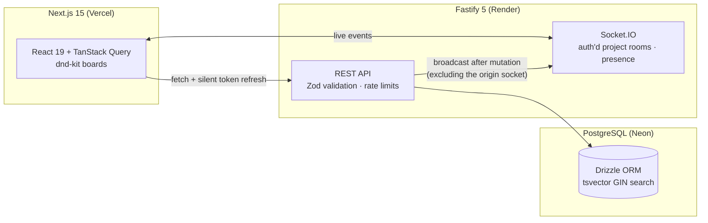

# PulseBoard

**Real-time project tracking for fast-moving teams** — a Linear/Trello-style kanban app with live multiplayer collaboration, built end-to-end as a production-grade TypeScript monorepo.


Drag a card on one screen and watch it move on another. PulseBoard keeps every open board in sync over WebSockets: issues, comments, and who's-online presence — no refresh button anywhere.

## Features

- **Kanban boards** with drag-and-drop, optimistic updates, and conflict-safe ordering (fractional indexing)
- **Real-time collaboration** — issue changes, comments, and presence sync live across all connected clients via Socket.IO rooms
- **Workspaces & projects** with role-based access control (owner / admin / member)
- **Issues** with statuses, priorities, assignees, labels, comments, and a full activity trail
- **Full-text search** (⌘K) across every issue in a workspace, backed by a Postgres GIN index
- **Secure auth**: short-lived JWT access tokens in memory + rotating httpOnly refresh cookies with **token-reuse detection** (a replayed refresh token revokes the whole session family)
- **Rate limiting**, input validation with Zod at every boundary, and consistent error envelopes

## Architecture



A change flows through the system like this: the client applies it **optimistically**, sends the REST mutation with its socket id, the server persists it and broadcasts the canonical result to everyone else in the project room — so the actor never sees an echo, and every other client converges on the server's truth.

More depth in [docs/ARCHITECTURE.md](docs/ARCHITECTURE.md): auth design, ordering under concurrency, realtime authorization, and scaling notes.

## Tech stack

| Layer     | Choices                                                                    |
| --------- | -------------------------------------------------------------------------- |
| Frontend  | Next.js 15 (App Router), React 19, TypeScript, Tailwind CSS 4, TanStack Query 5, dnd-kit |
| Backend   | Fastify 5, Socket.IO 4, Zod, jose (JWT)                                     |
| Database  | PostgreSQL, Drizzle ORM + drizzle-kit migrations, PGlite (in-memory PG for tests) |
| Tooling   | pnpm workspaces, Turborepo, Vitest, ESLint 9, Prettier, GitHub Actions      |

## Monorepo layout

```
pulseboard/
├── apps/
│   ├── api/        # Fastify REST + Socket.IO server, Drizzle schema & migrations, tests
│   └── web/        # Next.js app: board UI, auth, realtime cache sync
├── packages/
│   └── shared/     # Zod schemas, DTO types, socket event contracts (single source of truth)
├── .github/workflows/ci.yml
├── docker-compose.yml   # local Postgres + Redis
└── render.yaml          # one-click API deploy blueprint
```

## Quickstart (zero setup)

Requires Node 20+ and pnpm — **no Docker, no database**. Demo mode boots the API against an embedded in-memory Postgres (PGlite) with migrations applied:

```bash
pnpm install
pnpm --filter @pulseboard/api dev:demo   # API on :4000 (data resets on restart)
pnpm --filter @pulseboard/web dev        # web on :3000
```

Open http://localhost:3000, sign up, create a workspace → project, and open the board in two browser windows to see realtime sync.

## Local development with a real database

```bash
docker compose up -d                      # Postgres :5432 + Redis :6379
cp apps/api/.env.example apps/api/.env    # defaults match docker-compose
cp apps/web/.env.example apps/web/.env.local
pnpm --filter @pulseboard/api db:migrate
pnpm dev                                  # turbo runs api + web
```

## Tests & checks

```bash
pnpm test        # API integration tests against in-memory Postgres (PGlite)
pnpm typecheck   # strict TS across all packages
pnpm lint
pnpm build
```

The integration suite exercises real HTTP handlers against real Postgres semantics — auth flows (rotation, reuse detection), permissions (non-members get 404s), board ordering under moves, search — with no containers, so CI stays fast and deterministic.

## Deploying (free tier)

| Piece    | Service | Notes |
| -------- | ------- | ----- |
| Web      | [Vercel](https://vercel.com) | Import repo, set root directory to `apps/web`, add `NEXT_PUBLIC_API_URL` |
| API      | [Render](https://render.com) | `render.yaml` blueprint included — runs migrations on boot |
| Postgres | [Neon](https://neon.tech)    | Free serverless Postgres; paste the connection string into Render |

1. Create a Neon project, copy the pooled connection string.
2. On Render: **New → Blueprint**, point it at your fork; set `DATABASE_URL` and `WEB_ORIGIN` (your Vercel URL).
3. On Vercel: import the repo with root `apps/web`, set `NEXT_PUBLIC_API_URL` to the Render URL.

Cross-site cookies are preconfigured (`SameSite=None; Secure` in production).

## Engineering decisions worth reading

- **Ordering that survives concurrency** — card positions use [fractional indexing](https://observablehq.com/@dgreensp/implementing-fractional-indexing) (`generateKeyBetween`), so a move writes one row and two users reordering the same column simultaneously never corrupt each other's order. The client computes the same rank optimistically; the server's answer is canonical.
- **Refresh-token rotation with reuse detection** — every refresh invalidates the presented token and issues a new one; presenting a revoked token nukes all sessions for that user (mirrors OAuth2 BCP recommendations).
- **No echo, no flicker** — REST mutations carry the client's socket id; broadcasts use `room.except(socketId)` so the acting client only sees its optimistic update + HTTP response.
- **404 over 403** — non-members get "not found" for workspaces/projects they can't access, so resource ids aren't probeable.
- **Tests on embedded Postgres** — PGlite gives real Postgres semantics (enums, FKs, tsvector) in-process; the same migrations run in tests, dev demo mode, and production.

## License

[MIT](LICENSE)
